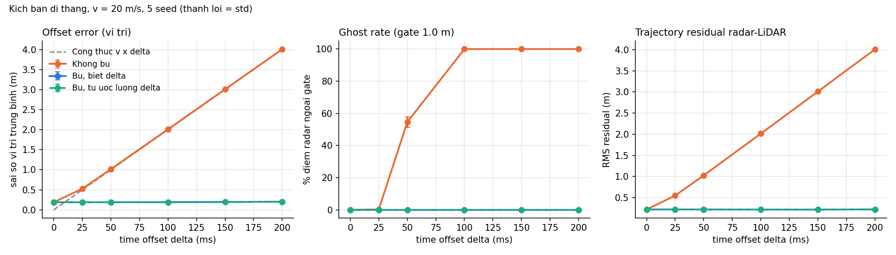

# Nghiên cứu cá nhân — Lệch thời gian và bù chuyển động LiDAR–radar

| Thông tin | Nội dung |
|---|---|
| Họ và tên | Đoàn Quang Thắng |
| MSSV | 2A202602395 |
| Nhóm | omai — 4 thành viên |
| Chủ đề | T4 — Time sync / motion compensation LiDAR–radar trong xe ADAS |
| Phần nghiên cứu phụ trách | Bài toán, tổng hợp kết quả và trình bày; giải thích quyết định và đánh đổi |
| URL repository chung | https://github.com/hieulovecat/K4-Track4-Day04-omai-Sensor-Reality-Sprint |
| Phiên bản bằng chứng của nhóm | Commit `7f35b84cf291faf2427a2e4fd6c4eba53308eaa5` |
| Ngày biên soạn | 06/10/2026 |

**Kết luận chính:** Trong dữ liệu mô phỏng của nhóm, vật thể đi thẳng ở 20 m/s với radar trễ 100 ms có sai số vị trí trung bình 2,01 m. Bù với độ trễ đã biết đưa sai số về 0,19 m. Tuy nhiên, khi độ trễ dao động giữa các mẫu, bù bằng một hằng số vẫn còn 11,7% điểm ngoài ngưỡng liên kết. Vì vậy, cần đánh giá cả độ ổn định của timestamp, không chỉ độ trễ trung bình.

**Cách sử dụng bằng chứng:** Báo cáo này phân tích mã nguồn, CSV, log và biểu đồ đã lưu của nhóm; không có lần chạy benchmark mới trong quá trình biên soạn. Nguồn bên ngoài được đối chiếu trực tuyến để viết phần phương pháp. Các hệ quả đối với xe thật và ngưỡng cải tiến được ghi rõ là suy luận hoặc đề xuất.

## 1. Problem — Bài toán

### Tình huống và tính năng

Xe ADAS, tức xe có hệ thống hỗ trợ người lái, sử dụng LiDAR và radar để theo dõi xe phía trước hoặc bên cạnh. Muốn kết hợp hai phép đo, hệ thống phải đưa chúng về cùng thời điểm. Nếu một điểm radar thuộc quá khứ nhưng được coi là điểm hiện tại, hai cảm biến có thể cho vị trí khác nhau dù cùng đo một vật thể.

Trong mô phỏng, LiDAR đo ở 10 Hz và làm mốc thời gian; radar đo ở 20 Hz. Nhiễu vị trí có độ lệch chuẩn lần lượt 0,05 m và 0,15 m trên mỗi trục. Timestamp là nhãn thời gian gắn với phép đo. Radar mang nhãn `t` nhưng thực sự đo tại `t − Δ`; `Δ > 0` là độ trễ, tính bằng giây khi đưa vào công thức.

Trễ bộ đệm driver, truyền CAN/Ethernet hoặc đồng hồ không đồng bộ là các nguyên nhân giả định cho bối cảnh. Benchmark chỉ tạo lỗi bằng cách dịch thời điểm lấy mẫu; chưa mô phỏng hay đo trực tiếp các cơ chế đó.

### Claim và phạm vi

Tôi kiểm tra nhận định: khi vật thể chuyển động thẳng với vận tốc `v`, độ lệch vị trí do thời gian xấp xỉ `v × Δ`. Khi độ lệch này tiến tới hoặc vượt ngưỡng liên kết 1 m, tỷ lệ điểm radar không khớp với LiDAR sẽ tăng. Bù chuyển động với offset đúng và ổn định dự kiến đưa sai số về gần mức nhiễu cảm biến.

Ví dụ: `20 m/s × 0,100 s = 2 m`. Đây là khoảng cách vật thể đi được trong thời gian trễ, không phải sai số đo khoảng cách vốn có của radar.

Phạm vi kiểm tra là một vật thể trong không gian 2D, dữ liệu tổng hợp, nhiễu Gauss và timestamp LiDAR đúng. Chưa có chuyển động của xe mang cảm biến, che khuất, nhiều vật thể, ghép đối tượng hay bộ theo dõi thật. Ảnh hưởng tới cảnh báo va chạm là **suy luận kỹ thuật**, chưa phải kết quả đo của bài này.

## 2. Method — Nguồn và phương pháp

### Nguồn tham khảo

| Nội dung | Ghi chép |
|---|---|
| Paper chính | Tong Qin, Shaojie Shen, *Online Temporal Calibration for Monocular Visual-Inertial Systems*, IROS 2018; [arXiv v1](https://arxiv.org/abs/1808.00692v1), [PDF](https://arxiv.org/pdf/1808.00692). |
| Input → output | Ảnh camera + IMU → offset, trạng thái camera/IMU và vị trí feature; tối ưu chung (Abstract, III-D). |
| Dữ liệu và metric nguồn | Mô phỏng: 500 feature, 30 s, camera 10 Hz, IMU 100 Hz, offset 5/15/30 ms, 100 lần/mức; Mean/RMSE (ms), NEES (IV-B.1, Bảng I). EuRoC: RMSE quỹ đạo (m), Bảng II. |
| Giả định nguồn | Offset hằng số (III-A); vận tốc feature gần hằng trong khoảng ngắn (III-B); đủ quay/gia tốc để hiệu chuẩn (IV-B.2). |
| Quy ước dấu nguồn | `t_IMU = t_cam + td` (III-A, pt. 1); với vai trò mốc tương ứng của nhóm, `td = −Δ`. |

Phần tóm tắt trên dựa vào [Qin & Shen 2018](https://arxiv.org/pdf/1808.00692); không dùng số liệu camera–IMU để so sánh trực tiếp với LiDAR–radar.

**Repository nguồn:** [VINS-Mono](https://github.com/HKUST-Aerial-Robotics/VINS-Mono), phiên bản tham chiếu [commit `90dabb5`](https://github.com/HKUST-Aerial-Robotics/VINS-Mono/commit/90dabb5). Đã đối chiếu README và trang commit; chưa biên dịch hoặc chạy VINS-Mono. README mục 5.4 hướng dẫn bật `estimate_td: 1` để hiệu chuẩn thời gian online. README mục 1 nêu Ubuntu 16.04, ROS Kinetic và Ceres 1.14.0; đây là yêu cầu của mã nguồn tham khảo, không phải môi trường benchmark Python của nhóm.

### Phương pháp trong mô phỏng

Nhóm áp dụng ý tưởng đưa phép đo về cùng thời điểm. Hệ gốc làm việc với camera–IMU; nhóm dùng vị trí LiDAR–radar 2D và tìm offset bằng cách thử một dãy giá trị trên toàn bộ chuỗi đã có. Đây là phương pháp offline: chưa chứng minh khả năng xử lý luồng dữ liệu trực tiếp.

| Phương pháp | Cách xử lý trong [benchmark.py](../t4_time_sync/benchmark.py) | Điều kiện cần |
|---|---|---|
| `none` — không bù | Dùng nguyên vị trí radar gắn nhãn `t`. | Là đối chứng để quan sát lỗi thời gian. |
| `comp_known` — bù biết offset | Dùng `Δ` danh định từ cấu hình; tính `p_bù = z_radar + v_ước_lượng × Δ`. | Biết offset ổn định; có vận tốc phù hợp. Trong jitter, chỉ biết offset trung bình, không biết độ trễ từng mẫu. |
| `comp_est` — bù tự ước lượng | Thử 601 giá trị từ −300 đến +300 ms, bước 1 ms; chọn `Δ̂` làm trung bình bình phương khoảng cách radar với LiDAR nội suy tại `t − Δ̂` nhỏ nhất; sau đó bù. | Có chuyển động đủ rõ; giả định một offset cho cả chuỗi. |

Vận tốc lấy bằng sai phân vị trí LiDAR (`np.gradient`), rồi nội suy tại `t − Δ̂/2`, tức giữa khoảng bù. Không lấy vận tốc chuẩn của mô phỏng để bù. Với `comp_known`, thay `Δ̂` bằng `Δ` danh định.

**Đơn vị và dấu:** Đổi `offset_ms / 1000` trước khi nhân vận tốc m/s. Radar đo ở `t − Δ`, nên đẩy vị trí tới nhãn `t` bằng dấu cộng `v × Δ`. Dịch nhãn thời gian để xác định thời điểm đo và dịch vị trí để dự đoán tới thời điểm đích là hai thao tác cần phân biệt.

## 3. Benchmark — Cách đo và kết quả

### Cấu hình và độ lặp lại

| Điều kiện | Cấu hình thực tế |
|---|---|
| Quỹ đạo | Lưới thời gian chuẩn 1 ms; đi thẳng, phanh/rẽ, jitter và đứng yên; thời lượng đo 20 s. |
| Sensor | LiDAR 10 Hz, σ = 0,05 m; radar 20 Hz, σ = 0,15 m; pha lấy mẫu radar 0,013 s. |
| Số mẫu | 200 mẫu LiDAR, 400 mẫu radar trước lọc biên; 382 mẫu radar được đánh giá cho mỗi cấu hình/seed. |
| Baseline | `straight`, `speed_mps=20`, `offset_ms=0`, `method=none`. |
| Điều kiện lỗi chính | Cùng chuyển động, offset 50 hoặc 100 ms; quét đầy đủ 0/25/50/100/150/200 ms và tốc độ 5/10/20/30 m/s. |
| Jitter | Độ trễ danh định 100 ms cộng nhiễu Gauss có σ = 30 ms. |
| Độ lặp lại | 5 seed `[0,1,2,3,4]`; metric tính từng seed rồi lấy trung bình; CSV tổng hợp có cả độ lệch chuẩn. |
| Quy mô kết quả | 27 cấu hình × 3 phương pháp × 5 seed = 405 dòng CSV thô; 81 dòng tổng hợp. |

### Định nghĩa metric

Gọi `p_i` là vị trí radar sau xử lý, `g_i` là vị trí chuẩn tại timestamp và `l_i` là vị trí LiDAR nội suy cùng timestamp. `N = 382` trong mỗi lần thử.

| Metric | Công thức | Đơn vị và ý nghĩa |
|---|---|---|
| Sai số vị trí trung bình | `mean(‖p_i − g_i‖)` | m; thấp hơn tốt hơn; cần vị trí chuẩn. |
| p95 sai số vị trí | Phân vị 95% của `‖p_i − g_i‖` | m; phản ánh phần đuôi sai số; báo cáo lấy trung bình p95 của 5 seed. |
| Ghost rate | `100 × count(‖p_i − l_i‖ > 1 m) / N` | %; tỷ lệ điểm ngoài ngưỡng liên kết, là chỉ số thay thế, chưa phải số vật thể ảo. |
| Residual RMS | `sqrt(mean(‖p_i − l_i‖²))` | m; độ không khớp giữa hai cảm biến; không cần vị trí chuẩn. |
| Sai số ước lượng offset | `abs(Δ̂ − Δ) × 1000` | ms; chỉ với `comp_est`; ở jitter, so với offset danh định. |

### Kết quả tôi chọn để trình bày

Số liệu dưới đây lấy từ [CSV tổng hợp](../t4_time_sync/results/results_agg.csv), làm tròn hai chữ số cho sai số và một chữ số cho tỷ lệ. Khóa tìm hàng: `scenario=straight`, `speed_mps=20`, `offset_ms` và `method` như bảng.

| Điều kiện | Phương pháp | Sai số vị trí TB (m) | Ghost rate (%) | Residual RMS (m) |
|---|---|---|---|---|
| Baseline: 0 ms | `none` | 0,19 | 0,0 | 0,22 |
| Lỗi: 50 ms | `none` | 1,02 | 54,6 | 1,03 |
| Lỗi: 100 ms | `none` | 2,01 | 100,0 | 2,02 |
| Cùng lỗi: 100 ms | `comp_known` | 0,19 | 0,0 | 0,22 |
| Cùng lỗi: 100 ms | `comp_est` | 0,19 | 0,0 | 0,22 |



**Nhận xét cá nhân:** Mức 100 ms phù hợp dự đoán 2 m; bù biết offset giảm khoảng 90,5% sai số vị trí so với không bù, tính từ CSV chưa làm tròn. Mức 50 ms đáng chú ý hơn khi trình bày: độ lệch lý thuyết vừa bằng ngưỡng 1 m nhưng đã có 54,6% điểm ngoài ngưỡng do nhiễu. Vì vậy, `gate / v` chỉ là mốc hình học, không phải giới hạn vận hành đã bảo đảm tỷ lệ lỗi thấp.

Khi `v × Δ` nhỏ, nhiễu không thể bỏ qua: ở 5 m/s và 25 ms, dự đoán 0,125 m nhưng sai số đo khoảng 0,22 m. Với đi thẳng, `comp_est` có sai số offset trung bình 0,2 ms trong bộ thử; không suy rộng con số này sang dữ liệu thật.

**Bằng chứng đối chiếu:** [bảng 1–4](../t4_time_sync/results/summary.md), [CSV từng seed](../t4_time_sync/results/results_raw.csv), [log chạy](../t4_time_sync/results/run_log.txt), [plot kiểm tra công thức](../t4_time_sync/results/fig3_formula_check.png). Log và bảng có thời điểm ghi khác nhau; không khẳng định chúng thuộc cùng một lần chạy. Cấu hình và các số liệu hiển thị tương ứng với bộ CSV đã lưu.

### Tái hiện và môi trường

Log đã lưu ghi Python **3.11.7**, NumPy **1.26.4**, lệnh `benchmark.py` và thư mục đầu ra Windows của người chạy. Phiên bản chính xác pandas/Matplotlib chưa được log đó ghi lại. Báo cáo hiện chỉ phân tích kết quả có sẵn.

Lệnh tái hiện đề xuất từ thư mục gốc, sau khi chuẩn bị thư viện theo [hướng dẫn môi trường](../t4_time_sync/README.md#chạy-lại-từ-thư-mục-gốc-repository):

```bash
T4_RESEARCH_DIR=$(mktemp -d /tmp/omai-t4-research-XXXXXX)
python -m pip freeze > "$T4_RESEARCH_DIR/environment.txt"
set -o pipefail
python t4_time_sync/benchmark.py --out "$T4_RESEARCH_DIR" 2>&1 | tee "$T4_RESEARCH_DIR/run_log.txt"
```

Mỗi lần dùng thư mục mới để giữ nguyên bằng chứng cũ. Lệnh trên chưa được thực thi khi viết báo cáo; chưa có kết quả chạy lại hoặc đo thời gian xử lý mới.

## 4. Failure case — Timestamp dao động giữa các mẫu

Tôi chọn jitter vì tình huống này cho thấy giới hạn của việc chỉ sửa độ trễ trung bình. Cấu hình: `scenario=jitter`, `speed_mps=20`, `offset_ms=100`, σ jitter 30 ms, 5 seed như mục 3. Mốc so sánh là đi thẳng với offset cố định 100 ms, cùng phương pháp bù.

| Điều kiện | Phương pháp | Sai số TB (m) | p95 (m) | Ghost rate (%) | Residual RMS (m) |
|---|---|---|---|---|---|
| Offset cố định 100 ms | `comp_known` | 0,19 | 0,37 | 0,0 | 0,22 |
| Jitter 100 ± 30 ms | `none` | 1,99 | 3,03 | 94,3 | 2,09 |
| Jitter 100 ± 30 ms | `comp_known` | 0,54 | 1,21 | 11,7 | 0,65 |
| Jitter 100 ± 30 ms | `comp_est` | 0,54 | 1,21 | 11,6 | 0,65 |

Ký hiệu `± 30 ms` mô tả độ lệch chuẩn, không phải biên tối đa của jitter. Bằng chứng: [CSV tổng hợp](../t4_time_sync/results/results_agg.csv), [bảng 4](../t4_time_sync/results/summary.md), [biểu đồ các tình huống](../t4_time_sync/results/fig4_scenarios.png).

**Nhóm quan sát được:** Cả hai phương pháp bù hằng số còn khoảng 0,54 m sai số và trên 11% điểm ngoài ngưỡng. Việc tự ước lượng offset trung bình không loại được dao động từng mẫu. Mốc `v × σ_jitter = 0,6 m` giải thích quy mô phần sai lệch còn lại, nhưng không đồng nhất với sai số trung bình Euclid 0,54 m.

**Đối chiếu nguồn:** Giả định offset hằng số đã nêu trong mục 2 không bao quát jitter của nhóm. Đây là khác biệt phạm vi mô hình; không lấy kết quả nguồn để tuyên bố phương pháp camera–IMU đã xử lý hoặc thất bại trên dữ liệu LiDAR–radar này.

**Suy luận kỹ thuật:** Trong một hệ theo dõi thật, điểm ngoài ngưỡng có thể bị loại hoặc ghép sai, làm giảm độ liên tục của track. Benchmark chưa đo số track, tỷ lệ cảnh báo hay tác động tới phanh; không diễn giải 11,7% thành tỷ lệ cảnh báo sai.

**Giới hạn bổ sung:** Một residual lớn không xác định duy nhất lỗi thời gian; trên hệ thật có thể do sai hiệu chuẩn không gian hoặc liên kết sai. Khi đứng yên, vấn đề ngược lại xuất hiện: residual vẫn khoảng 0,22 m dù offset 100 ms, trong khi `comp_est` sai trung bình 123 ms. Cột `speed_mps=20` của hàng `standstill` là tham số gọi hàm; vận tốc quỹ đạo thực tế bằng 0 theo `make_truth`. Vì vậy, residual nhỏ cũng chưa đủ để chứng minh đồng bộ đúng.

## 5. Engineering decision — Quyết định và đánh đổi

**Tôi đề xuất:** Bù chuyển động khi có offset đáng tin cậy, đồng thời giám sát residual trong đoạn có chuyển động. Nếu độ không khớp vẫn lớn sau bù, giảm trọng số radar trong kết hợp vị trí và kiểm tra nguồn timestamp. Khi đứng yên, giữ offset đã hiệu chuẩn thay vì cập nhật từ dữ liệu thiếu thông tin thời gian.

Lý do: offset cố định 100 ms đã bù về gần baseline, còn jitter vẫn gây trên 11% điểm ngoài ngưỡng. Ưu tiên tiếp theo là giảm dao động thời gian và phát hiện điều kiện mà bộ ước lượng không đáng tin.

| Câu hỏi | Trả lời |
|---|---|
| Khi nào áp dụng? | Đề xuất cảnh báo nếu residual RMS > 0,5 m trong cửa sổ 1 s, kéo dài 3 cửa sổ liên tiếp khi vận tốc > 5 m/s. Đây là ngưỡng và thời gian giữ mới đề xuất, chưa được đo. |
| Cập nhật offset lúc nào? | Đề xuất chỉ cập nhật khi vận tốc > 3 m/s; lúc đứng yên giữ giá trị cũ. Ngoài tốc độ còn cần kiểm tra độ rõ của cực tiểu hàm chi phí; ngưỡng chưa được hiệu chỉnh. |
| Lợi ích dự kiến | Phát hiện trường hợp bù offset trung bình chưa đủ; hạn chế dùng vị trí radar thiếu nhất quán; tránh cập nhật offset sai lúc đứng yên. |
| Chi phí và đánh đổi | Cần cửa sổ dữ liệu, trạng thái giám sát và log; phát hiện có độ trễ. Giảm trọng số radar có thể làm mất lợi ích của cảm biến này; benchmark chưa đo mức đánh đổi. |
| Khi không phù hợp? | Residual lớn do sai hiệu chuẩn hoặc ghép nhầm cần chẩn đoán riêng. Không tự ước lượng một offset hằng từ chuỗi đứng yên hoặc kỳ vọng nó sửa jitter từng mẫu. |
| Hướng xử lý từ nguồn | Khảo sát timestamp phần cứng hoặc đồng bộ đồng hồ tại driver; đo jitter trước/sau để xác định hiệu quả. Chưa triển khai trong repo. |
| Trạng thái | Bù `comp_known`/`comp_est` đã có mã và số đo mô phỏng. Giám sát theo cửa sổ, giữ offset khi đứng yên, giảm trọng số radar và đồng bộ phần cứng mới là đề xuất. |

### Phép thử tiếp theo

1. Tạo đầu ra mới, giữ 20 m/s và offset danh định 100 ms; quét σ jitter 0/5/10/30 ms với cùng bộ seed. Đo sai số trung bình, p95, ghost rate và residual. Mục tiêu đề xuất: ghost rate < 1% sau cải tiến, sai số trung bình ≤ 0,25 m ở σ ≤ 10 ms; chưa có bằng chứng đạt.
2. Thử chuỗi chạy → dừng → chạy lại; so sánh cập nhật offset liên tục với giữ offset khi dừng. Ghi sai số offset và sai số vị trí lúc chạy lại. Mục tiêu đề xuất: sai số offset < 10 ms khi có đủ chuyển động và không suy giảm vì giai đoạn dừng.
3. Thử thay đổi offset đột ngột và lỗi hiệu chuẩn không gian riêng biệt để đo độ trễ cảnh báo, báo động giả, lỗi bỏ sót và chi phí xử lý. Sau đó mới chọn ngưỡng giám sát; chưa gắn ngưỡng này với quyết định điều khiển xe.

## Gợi ý trình bày cá nhân trong 3–5 phút

| Thời lượng | Nội dung trình bày | Bằng chứng mở kèm |
|---|---|---|
| 40 giây | Một vật thể ở hai thời điểm: 20 m/s, trễ 100 ms nghĩa là lệch khoảng 2 m. | [Timeline](../t4_time_sync/results/fig1_timeline.png) |
| 50 giây | Giải thích ba phương pháp và nguồn vận tốc từ LiDAR; phân biệt biết offset với tự ước lượng. | Mục 2 |
| 70 giây | Chọn baseline, lỗi 100 ms và sau bù; nhấn mạnh mốc 50 ms đã có 54,6% điểm ngoài ngưỡng. | Bảng mục 3 và plot offset |
| 50 giây | Jitter vẫn còn 11,7%; tự ước lượng một hằng số chưa giải quyết dao động từng mẫu. | Bảng mục 4 |
| 50 giây | Quyết định giám sát, giữ offset khi dừng và phép thử tiếp theo; nói rõ giới hạn mô phỏng. | Mục 5 |

**Thông điệp tôi muốn người nghe nhớ:** Lệch thời gian tạo sai lệch vị trí tỷ lệ với chuyển động. Bù hiệu quả với offset ổn định; jitter và thiếu chuyển động đòi hỏi kiểm tra chất lượng ước lượng trước khi sử dụng.

## Tự kiểm trước khi nộp

- [x] Ghi họ tên, MSSV, phần phụ trách và URL repository chung.
- [x] Đủ 5 mục theo mẫu; có baseline, điều kiện lỗi, metric và đơn vị.
- [x] Dẫn nguồn, phiên bản tham chiếu, cấu hình, CSV/log/plot và lệnh tái hiện.
- [x] Phân biệt số đo nhóm, nội dung nguồn và suy luận kỹ thuật; ghi rõ chưa chạy lại.
- [x] Có failure case, đề xuất, đánh đổi và tiêu chí kiểm chứng tiếp.
- [x] Đã tạo bản cá nhân trong `docs/`.
- [ ] Cá nhân đọc lại, xác nhận hiểu nội dung và tập trình bày 3–5 phút.
- [ ] Đưa bản báo cáo lên repository từ xa để URL nộp bài truy cập được.
- [ ] Nộp riêng trên VLearn và mở lại kiểm tra tệp/link đã nộp.
