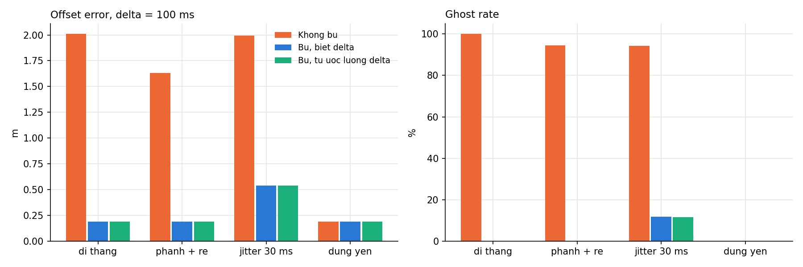
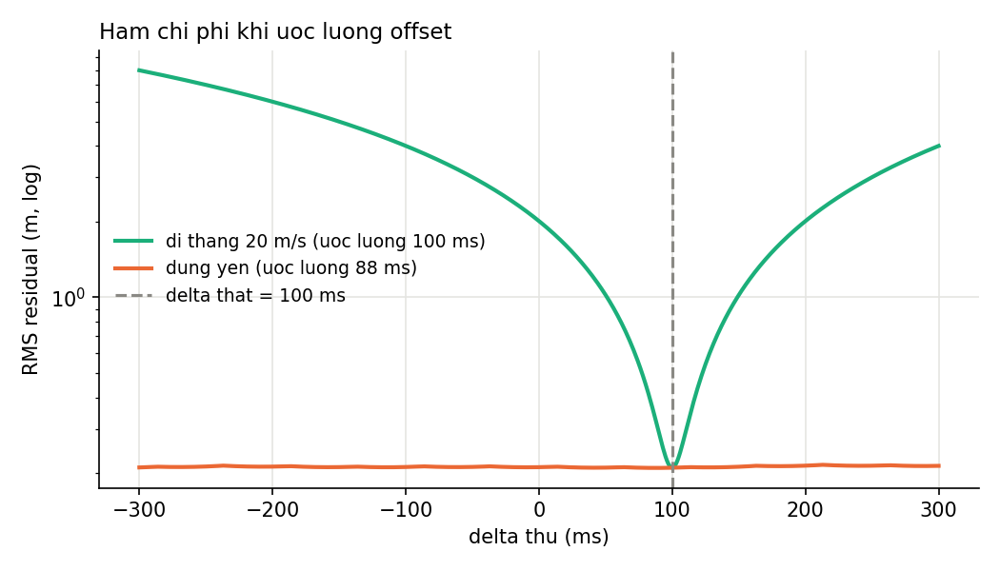

# Nghiên cứu cá nhân — Lệch thời gian và bù chuyển động LiDAR–radar

| Thông tin | Nội dung |
|---|---|
| Họ và tên | Nguyễn Hữu Chương |
| MSSV | 2A202602601 |
| Nhóm | omai — 4 thành viên |
| Chủ đề | T4 — Time sync / motion compensation LiDAR–radar trong xe ADAS |
| Phần nghiên cứu phụ trách | Phân tích tình huống lỗi (Failure case) và Đề xuất cải tiến (Engineering decision) |
| URL repository chung | https://github.com/hieulovecat/K4-Track4-Day04-omai-Sensor-Reality-Sprint |
| Phiên bản bằng chứng của nhóm | |
| Ngày biên soạn | 06/10/2026 |

**Kết luận chính:** Bù chuyển động dựa trên offset thời gian cố định rất hiệu quả khi độ trễ ổn định (đưa sai số từ 2,01 m về 0,19 m ở 20 m/s trễ 100 ms). Tuy nhiên, phương pháp này gặp hai giới hạn nghiêm trọng: 
(1) Khi timestamp bị dao động ngẫu nhiên (jitter $\sigma = 30\text{ ms}$), bù bằng một offset hằng số vẫn để lại sai số trung bình 0,54 m và 11,7% điểm ngoài ngưỡng liên kết; (2) Khi xe đứng yên, các metric vị trí không phát hiện được lỗi nhưng thuật toán ước lượng offset bị suy biến hoàn toàn (sai số ước lượng vọt lên 123 ms). Do đó, hệ thống cần cơ chế đóng băng offset khi dừng, kết hợp giám sát trajectory residual online và giải pháp đồng bộ thời gian phần cứng (PTP) để xử lý triệt để jitter.

**Phạm vi và nguồn bằng chứng:** Báo cáo này hoàn toàn dựa trên dữ liệu, mã nguồn và kết quả thực nghiệm có sẵn trong repository của nhóm (`t4_time_sync/` và `docs/`), không chạy thêm benchmark mới. Toàn bộ nhận xét về hệ thống xe thật được phân định rõ ràng giữa kết quả đo trực tiếp, thông tin từ tài liệu tham khảo và suy luận kỹ thuật.

---

## 1. Problem — Bài toán

### Tình huống và tính năng
Trong hệ thống hỗ trợ lái xe nâng cao (ADAS), tính năng kết hợp (fusion) dữ liệu LiDAR và radar đóng vai trò cốt lõi để theo dõi vật thể (object tracking), ước lượng khoảng cách và kích hoạt phanh khẩn cấp tự động (AEB).
- **Cảm biến mô phỏng:** LiDAR hoạt động ở tần số 10 Hz ($\sigma = 0{,}05\text{ m}$), được chọn làm mốc thời gian chuẩn; radar hoạt động ở tần số 20 Hz ($\sigma = 0{,}15\text{ m}$).
- **Cơ chế lỗi (Failure mechanism):** Timestamp của radar bị trễ một khoảng $\Delta > 0$ do bộ đệm driver, độ trễ truyền thông CAN/Ethernet hoặc xung nhịp đồng hồ không đồng bộ. Radar thực tế đo vật thể tại thời điểm $t - \Delta$ nhưng nhãn thời gian gắn với gói tin lại là $t$.
- **Hệ quả hình học:** Khi vật thể di chuyển với vận tốc $v$, radar ghi nhận vị trí cũ cách vị trí thực một khoảng xấp xỉ $v \times \Delta$. Nếu khoảng lệch này vượt quá ngưỡng liên kết dữ liệu (gate liên kết giả định là 1,0 m), thuật toán fusion sẽ không thể ghép điểm radar vào track LiDAR, dẫn đến sinh vật thể ảo (ghost object) hoặc mất dấu vật thể.

### Claim ban đầu và giới hạn kiểm chứng
- **Claim:** Sai số vị trí tỉ lệ thuận với tích $v \times \Delta$. Khi bù chuyển động tuyến tính với offset chính xác, sai số vị trí sẽ giảm về mức nhiễu cảm biến gốc ($\approx 0{,}19\text{ m}$).
- **Giới hạn mô phỏng:** Thử nghiệm thực hiện trên không gian 2D với dữ liệu tổng hợp (synthetic), nhiễu Gauss, một vật thể đơn lẻ, giả định timestamp LiDAR hoàn hảo và không xét chuyển động tự thân của xe mang cảm biến (ego-motion). Các nhận định về tác động lên tỷ lệ cảnh báo AEB hay quyết định lái của xe thật là **suy luận kỹ thuật**.

---

## 2. Method — Nguồn và phương pháp

### Nguồn tham khảo chính
- **Paper:** Tong Qin, Shaojie Shen, *Online Temporal Calibration for Monocular Visual-Inertial Systems*, IEEE/RSJ IROS 2018 ([arXiv:1808.00692](https://arxiv.org/abs/1808.00692)).
- **Repository:** HKUST-Aerial-Robotics / [VINS-Mono](https://github.com/HKUST-Aerial-Robotics/VINS-Mono).
- **Nguyên lý gốc:** Bài báo ước lượng độ lệch thời gian $t_d$ giữa camera và IMU bằng cách: 
(1) Tính vận tốc feature trên ảnh $V = (z_{k+1} - z_k)/(t_{k+1} - t_k)$; 
(2) Bù quan sát theo mô hình vận tốc không đổi trong khoảng ngắn: $z(t_d) = z + t_d \cdot V$; 
(3) Đưa $t_d$ vào vector trạng thái và tối ưu hóa phi tuyến cửa sổ trượt (bundle adjustment) bằng Ceres Solver.
- **Giả định then chốt của nguồn:**
  * Độ lệch thời gian $t_d$ là **hằng số** trong khoảng thời gian ước lượng (Mục III-A). Nguồn nêu rõ nếu offset biến thiên liên tục/trôi dạt thì cảm biến đó không đủ tiêu chuẩn để fusion.
  * Hệ thống phải có **đủ chuyển động kích thích** (quay và gia tốc) để offset có thể quan sát được (observable, Mục IV-B.2).
- **Quy ước dấu:** Nguồn định nghĩa $t_{\text{IMU}} = t_{\text{cam}} + t_d$. Khi camera trễ hơn IMU thì $t_d < 0$. Trong benchmark của nhóm, LiDAR đóng vai trò mốc chuẩn (như IMU) và radar đóng vai trò cảm biến trễ (như camera). Do đó, độ trễ radar $\Delta$ của nhóm thỏa mãn: $\Delta = -t_d$.

### Thuật toán trong benchmark của nhóm ([benchmark.py](../t4_time_sync/benchmark.py))
Nhóm kế thừa nguyên lý bù chuyển động và hiệu chuẩn thời gian của Qin & Shen nhưng áp dụng cho bài toán LiDAR–radar 2D:

| Phương pháp | Đầu vào | Quy tắc xử lý | Giả định và điều kiện áp dụng |
|---|---|---|---|
| `none` (Không bù) | Tọa độ radar $z$, timestamp $t$ | Giữ nguyên tọa độ gốc $z$ tại nhãn $t$. | Timestamp chuẩn, không có độ trễ. Dùng làm đối chứng đo lường lỗi. |
| `comp_known` (Bù biết offset) | Tọa độ radar $z$, offset danh định $\Delta$, track LiDAR | Tính $p_{\text{bù}} = z + v \cdot \Delta$, với vận tốc $v$ lấy từ sai phân vị trí LiDAR nội suy tại giữa khoảng bù ($t - \Delta/2$). | Biết trước offset chính xác và offset phải là hằng số cố định. |
| `comp_est` (Bù tự ước lượng) | Chuỗi đo LiDAR và radar | Quét grid search 601 giá trị offset từ $-300\text{ ms}$ đến $+300\text{ ms}$ (bước $1\text{ ms}$); tìm $\hat{\Delta}$ tối thiểu hóa trung bình bình phương khoảng cách giữa radar và LiDAR nội suy; sau đó bù $z + v \cdot \hat{\Delta}$. | Offset là hằng số cho cả chuỗi; vật thể phải có chuyển động tương đối rõ ràng. |

---

## 3. Benchmark — Cách đo và kết quả

### Thiết lập thực nghiệm
- **Quỹ đạo và kịch bản:** Thời lượng 20 s, bước thời gian chuẩn 1 ms. Các kịch bản gồm: đi thẳng (`straight`), cơ động phanh + rẽ (`maneuver`), trễ dao động (`jitter`), và xe đứng yên (`standstill`).
- **Cảm biến:** LiDAR 10 Hz, $\sigma = 0{,}05\text{ m}$; Radar 20 Hz, $\sigma = 0{,}15\text{ m}$. Đánh giá 382 mẫu radar hợp lệ trên mỗi lần chạy sau khi lọc biên.
- **Độ tin cậy:** Chạy trên 5 seed ngẫu nhiên `[0, 1, 2, 3, 4]`, ghi nhận 405 dòng kết quả chi tiết trong [`results_raw.csv`](../t4_time_sync/results/results_raw.csv) và tổng hợp tại [`results_agg.csv`](../t4_time_sync/results/results_agg.csv).

### Metric đánh giá chính
1. **Sai số vị trí trung bình (m):** Khoảng cách Euclid giữa vị trí radar sau xử lý và ground truth tại timestamp đo (`mean(||p_i - g_i||)`).
2. **Phân vị 95 sai số (p95, m):** Phản ánh sai số cực trị trong các tình huống xấu nhất.
3. **Ghost rate (%):** Tỷ lệ mẫu radar cách vị trí LiDAR nội suy vượt quá gate liên kết $1{,}0\text{ m}$ (`||p_i - l_i|| > 1.0 m`).
4. **Trajectory residual RMS (m):** Độ lệch RMS trực tiếp giữa radar và LiDAR, không cần ground truth, có thể đo trực tiếp trên xe.
5. **Sai số ước lượng offset (ms):** $|\hat{\Delta} - \Delta|$, đo khả năng tìm lại offset của `comp_est`.

### Kết quả tổng hợp kịch bản đi thẳng ($v = 20\text{ m/s} \approx 72\text{ km/h}$)
*(Trích xuất từ bảng 1, [summary.md](../t4_time_sync/results/summary.md))*

| Độ trễ $\Delta$ (ms) | Phương pháp | Sai số vị trí TB (m) | Ghost rate (%) | Trajectory Residual RMS (m) | Sai số ước lượng offset (ms) |
|---|---|---|---|---|---|
| 0 (Baseline) | `none` | 0,19 | 0,0 | 0,22 | — |
| 50 | `none` | 1,02 | 54,6 | 1,03 | — |
| 50 | `comp_known` | 0,19 | 0,0 | 0,22 | — |
| 100 | `none` | 2,01 | 100,0 | 2,02 | — |
| 100 | `comp_known` | 0,19 | 0,0 | 0,22 | — |
| 100 | `comp_est` | 0,19 | 0,0 | 0,22 | 0,2 |

---

## 4. Failure case — Phân tích chuyên sâu các tình huống lỗi

Dưới vai trò phụ trách phân tích tình huống lỗi, tôi tập trung phân tích 3 trường hợp điển hình bộc lộ các hạn chế căn bản của thuật toán bù thời gian:

### 4.1. Tình huống lỗi 1: Timestamp dao động ngẫu nhiên (Jitter Failure)
* **Cấu hình thực nghiệm:** Kịch bản `jitter`, $v = 20\text{ m/s}$, độ trễ danh định $\Delta = 100\text{ ms}$, cộng nhiễu jitter Gauss với $\sigma_{\text{jitter}} = 30\text{ ms}$. Đánh giá trung bình trên 5 seed.

*(Số liệu trích xuất từ Bảng 4, [summary.md](../t4_time_sync/results/summary.md) và [results_agg.csv](../t4_time_sync/results/results_agg.csv))*

| Kịch bản | Phương pháp | Sai số TB (m) | p95 (m) | Ghost rate (%) | Residual RMS (m) | Sai số ước lượng $\hat{\Delta}$ (ms) |
|---|---|---|---|---|---|---|
| Offset cố định 100 ms | `comp_known` | 0,19 | 0,37 | 0,0 | 0,22 | — |
| Jitter $100 \pm 30\text{ ms}$ | `none` | 1,99 | 3,03 | 94,3 | 2,09 | — |
| Jitter $100 \pm 30\text{ ms}$ | `comp_known` | 0,54 | 1,21 | 11,7 | 0,65 | — |
| Jitter $100 \pm 30\text{ ms}$ | `comp_est` | 0,54 | 1,21 | 11,6 | 0,65 | 1,0 |

* **Nhóm quan sát được (Kết quả tự đo):**
  1. Khi có jitter, dù đã áp dụng bù biết trước offset trung bình danh định (`comp_known`) hay tự ước lượng offset tốt nhất trên cả chuỗi (`comp_est`, sai số ước lượng chỉ 1,0 ms), sai số vị trí trung bình vẫn bị kẹt ở mức **0,54 m** (cao gấp gần 3 lần mức baseline 0,19 m).
  2. Phân vị xấu nhất p95 vọt lên **1,21 m**, vượt qua ngưỡng gate liên kết 1,0 m. Hệ quả trực tiếp là **11,7%** số điểm radar bị văng ra ngoài gate liên kết.
  3. Residual RMS giữa hai cảm biến duy trì ở mức cao **0,65 m** (so với 0,22 m ở trạng thái đồng bộ tốt).
* **Bản chất toán học và cơ chế lỗi:**
  - Giả sử trễ thực tế của mẫu thứ $k$ là $\Delta_k = \bar{\Delta} + \epsilon_k$ với $\epsilon_k \sim \mathcal{N}(0, \sigma_{\text{jitter}}^2)$.
  - Khi bù bằng offset cố định $\bar{\Delta}$, vị trí bù là $p_k = z_k + v \cdot \bar{\Delta}$. Sai số vị trí tức thời còn sót lại là:
    $$e_k \approx v \cdot (\Delta_k - \bar{\Delta}) = v \cdot \epsilon_k$$
  - Với $v = 20\text{ m/s}$ và $\sigma_{\text{jitter}} = 0{,}03\text{ s}$, độ lệch chuẩn của sai số vị trí còn lại là $v \cdot \sigma_{\text{jitter}} = 20 \times 0{,}03 = 0{,}6\text{ m}$. Thành phần sai lệch này cộng hưởng với sai số đo của radar ($\sigma = 0{,}15\text{ m}$) khiến phân vị đuôi p95 chạm $1{,}21\text{ m}$, làm phát sinh 11,7% ghost points.
* **Đối chiếu kết luận nguồn (Qin & Shen 2018):**
  Bài báo Qin & Shen giả định tường minh rằng offset là một hằng số $t_d$ (Mục III-A). Nguồn đã khẳng định rằng nếu cảm biến có offset biến thiên hoặc dao động mạnh, hệ thống tối ưu hóa liên tục không thể hội tụ chính xác và coi cảm biến đó là "unqualified for fusion". Thực nghiệm của nhóm đã chứng minh định lượng giới hạn này trên dữ liệu radar: bù bằng một tham số hằng số hoàn toàn bất lực trước hiện tượng dao động trễ từng mẫu.

---

### 4.2. Tình huống lỗi 2: Xe đứng yên (Standstill / Lack of Excitation)
* **Cấu hình thực nghiệm:** Kịch bản `standstill`, vận tốc thực tế $v = 0\text{ m/s}$, độ trễ radar danh định $\Delta = 100\text{ ms}$, 5 seed.

*(Số liệu trích xuất từ Bảng 4, [summary.md](../t4_time_sync/results/summary.md))*

| Phương pháp | Sai số TB (m) | p95 (m) | Ghost rate (%) | Residual RMS (m) | Sai số ước lượng offset $\hat{\Delta}$ (ms) |
|---|---|---|---|---|---|
| `none` | 0,19 | 0,37 | 0,0 | 0,22 | — |
| `comp_known` | 0,19 | 0,37 | 0,0 | 0,22 | — |
| `comp_est` | 0,19 | 0,38 | 0,0 | 0,22 | **123,0** |

* **Nhóm quan sát được (Kết quả tự đo):**
  1. Khi đứng yên, các metric giám sát vị trí như Ghost rate (0,0%) và Residual RMS (0,22 m) cho kết quả "hoàn hảo", hoàn toàn giống hệt trường hợp không có lỗi thời gian.
  2. Tuy nhiên, sai số ước lượng offset của thuật toán `comp_est` lại bị sai lệch nghiêm trọng: trung bình **123,0 ms** (lệch hoàn toàn khỏi giá trị thật 100 ms).
* **Cơ chế lỗi:**
  - Khi $v = 0$, vật thể đứng yên tại chỗ. Dù radar đo trễ $\Delta = 100\text{ ms}$ hay $0\text{ ms}$, vị trí vật thể tại thời điểm $t - \Delta$ và thời điểm $t$ là như nhau ($p(t - \Delta) = p(t)$).
  - Khoảng cách giữa LiDAR và radar nội suy với bất kỳ giá trị thử $\hat{\Delta}$ nào cũng chỉ phản ánh nhiễu cảm biến thuần túy: $||z_{\text{radar}} - l_{\text{LiDAR}}(t - \hat{\Delta})|| \approx \text{nhiễu}$.
  - Đồ thị hàm chi phí $J(\hat{\Delta})$ trong [`fig6_offset_cost.png`](../t4_time_sync/results/fig6_offset_cost.png) trở thành một đường nằm ngang hoàn toàn phẳng đáy. Điểm cực tiểu rơi ngẫu nhiên vào các gợn sóng nhiễu của cảm biến, làm thuật toán chọn giá trị offset sai lệch ngẫu nhiên.
* **Suy luận kỹ thuật về rủi ro vận hành:**
  Nếu một hệ thống ADAS liên tục cập nhật offset online trong lúc xe dừng chờ đèn đỏ, thuật toán sẽ hấp thụ giá trị $\hat{\Delta}$ sai lệch này. Ngay khi xe khởi hành tăng tốc lên 20 m/s, lượng bù sai lệch $v \cdot \hat{\Delta}_{\text{sai}}$ sẽ lập tức tạo ra sai số vị trí nhân tạo lên tới $20 \times 0{,}123 \approx 2{,}46\text{ m}$, làm lệch hoàn toàn hệ thống bám vết vật thể.
* **Đối chiếu nguồn:** Khớp chính xác với cảnh báo trong Mục IV-B.2 của Qin & Shen 2018: thuật toán calibration thời gian bắt buộc phải có "sufficient excitation" (đủ chuyển động) để tham số trễ quan sát được (observable). Khi đứng yên, hệ thống bị rơi vào trạng thái suy biến (unobservable).

---

### 4.3. Trường hợp ngược dự đoán: Cơ động phanh + rẽ (Maneuver)
* **Cấu hình thực nghiệm:** Kịch bản `maneuver`, $v = 20\text{ m/s}$, độ trễ $\Delta = 100\text{ ms}$, gia tốc ngang $a = 4\text{ m/s}^2$.

*(Số liệu trích xuất từ Bảng 4, [summary.md](../t4_time_sync/results/summary.md))*

| Phương pháp | Sai số TB (m) | p95 (m) | Ghost rate (%) | Residual RMS (m) | Sai số ước lượng offset $\hat{\Delta}$ (ms) |
|---|---|---|---|---|---|
| `none` | 1,63 | 2,17 | 94,4 | 1,68 | — |
| `comp_known` | 0,19 | 0,37 | 0,0 | 0,22 | — |
| `comp_est` | 0,19 | 0,37 | 0,0 | 0,22 | 0,2 |

* **Nhận định kỹ thuật:**
  Ban đầu nhóm đặt giả thuyết rằng bù tuyến tính theo vận tốc ($z + v \cdot \Delta$) sẽ thất bại khi xe chuyển động cong có gia tốc lớn. Tuy nhiên kết quả đo cho thấy: bù tuyến tính vẫn đưa sai số vị trí về mức baseline **0,19 m** và ghost rate về **0,0%**.
  * **Giải thích:** Sai số do bỏ qua số hạng gia tốc bậc hai xấp xỉ:
    $$e_{\text{acc}} \approx \frac{1}{2} a \Delta^2 = \frac{1}{2} \times 4\text{ m/s}^2 \times (0{,}1\text{ s})^2 = 0{,}02\text{ m}$$
    Sai số $0{,}02\text{ m}$ nhỏ hơn rất nhiều so với mức nhiễu của radar ($\sigma = 0{,}15\text{ m}$). Vì vậy, bù vận tốc tại điểm giữa khoảng bù ($t - \hat{\Delta}/2$) là hoàn toàn đủ chính xác cho các cơ động thông thường của xe thương mại.

---

## 5. Engineering decision — Quyết định kỹ thuật và Đánh đổi

Từ các phát hiện định lượng trên, tôi đề xuất kiến trúc xử lý 3 tầng cho hệ thống fusion LiDAR–radar:

### 5.1. Các đề xuất kỹ thuật cụ thể

1. **Cơ chế khóa cập nhật khi thiếu chuyển động (Excitation-gated Calibration):**
   * *Quy tắc:* Chỉ kích hoạt module ước lượng/cập nhật online $\hat{\Delta}$ khi thỏa mãn đồng thời hai điều kiện:
     1. Vận tốc tương đối của vật thể hoặc vận tốc xe $v > 3{,}0\text{ m/s}$.
     2. Độ cong đáy của hàm chi phí $\frac{\partial^2 J}{\partial \Delta^2} > \gamma_{\text{threshold}}$ (đảm bảo cực tiểu sắc nét, không bị phẳng).
   * *Hành vi khi dừng:* Khi xe chạy chậm hoặc dừng đèn đỏ ($v \le 3{,}0\text{ m/s}$), **đóng băng (freeze)** giá trị $\hat{\Delta}$ đã học được trước đó; tuyệt đối không cập nhật từ dữ liệu tĩnh.

2. **Giám sát chất lượng đồng bộ trực tuyến (Online Trajectory Residual Health Check):**
   * *Quy tắc:* Liên tục tính toán giá trị Residual RMS giữa radar sau bù và track LiDAR trên cửa sổ trượt $1{,}0\text{ s}$.
   * *Ngưỡng cảnh báo:* Nếu Residual RMS vượt quá ngưỡng $0{,}5\text{ m}$ (ngưỡng bình thường khi đồng bộ tốt là $0{,}22\text{ m}$) kéo dài trên 3 cửa sổ liên tiếp khi $v > 5\text{ m/s}$:
     * Hệ thống phát tín hiệu cảnh báo suy giảm đồng bộ thời gian (Sync Degraded Flag).
     * **Cơ chế Fallback:** Tạm thời giảm trọng số đo vị trí của radar trong bộ lọc Kalman/EIO (de-weighting) hoặc chỉ dùng radar cho thông tin vận tốc Doppler (ít nhạy cảm với lỗi vị trí thời gian), tránh nguy cơ sinh ghost objects hoặc kích hoạt phanh sai.

3. **Giải pháp triệt tiêu Jitter từ tầng hệ thống (Hardware Synchronization):**
   * Kết quả ở Mục 4.1 khẳng định thuật toán phần mềm dùng offset cố định không thể giải quyết jitter.
   * *Giải pháp:* Chuyển đổi cơ chế gắn timestamp phần mềm (software timestamp tại driver OS) sang **đồng bộ phần cứng PTP (IEEE 1588)** hoặc xung PPS qua mạng Ethernet Time-Sensitive Networking (TSN). Timestamp phải được gắn trực tiếp tại phần cứng NIC/CAN transceiver ngay khi gói tin radar đến mạch thu.

---

### 5.2. Đánh đổi kỹ thuật giữa các phương án

| Phương án | Lợi ích đạt được | Chi phí / Giới hạn kỹ thuật | Điều kiện áp dụng phù hợp | Khi nào KHÔNG nên áp dụng? |
|---|---|---|---|---|
| **Không bù (`none`)** | Không tốn tài nguyên tính toán; triển khai đơn giản nhất. | Sai số tăng tuyến tính theo $v \times \Delta$; ở $72\text{ km/h}$ lệch tới $2\text{ m}$, ghost rate $100\%$. | Khi hệ thống đã có đồng bộ phần cứng hoàn hảo ($\Delta < 10\text{ ms}$). | Khi xe vận hành ở dải tốc độ cao ($v > 30\text{ km/h}$). |
| **Bù biết offset (`comp_known`)** | Đưa sai số về mức nhiễu cảm biến ($0{,}19\text{ m}$); chi phí tính toán cực thấp ($O(1)$). | Phụ thuộc vào offset cố định từ khâu cân chỉnh xuất xưởng; bất lực trước jitter từng mẫu ($11{,}7\%$ lỗi). | Khi trễ hệ thống ổn định và đã được đo đạc chính xác qua calibration tĩnh. | Khi đường truyền mạng xe có độ trễ biến thiên bất định hoặc clock trôi. |
| **Bù tự ước lượng (`comp_est`)** | Tự thích ứng với trễ thực tế; không cần biết trước offset; sai số ước lượng chỉ $0{,}2\text{ ms}$ khi chạy thẳng. | Chi phí tính toán quét lưới lớn; thuật toán offline; bị suy biến nghiêm trọng khi đứng yên (lệch $123\text{ ms}$). | Khi vật thể có chuyển động rõ ràng ($v > 3\text{ m/s}$) và offset ổn định trong cửa sổ quan sát. | Khi xe dừng đỗ / kẹt xe; hoặc khi timestamp bị jitter ngẫu nhiên. |
| **Giám sát Residual & Freeze khi dừng (Đề xuất)** | Ngăn chặn việc học sai offset lúc dừng; phát hiện sớm jitter để kích hoạt fallback an toàn. | Tốn thêm bộ đệm dữ liệu cửa sổ trượt; có độ trễ phát hiện cảnh báo (khoảng $1\text{ s}$). | Triển khai trên mọi hệ thống fusion LiDAR–radar trực tuyến. | Khi cảm biến bị lỗi lệch trục không gian (extrinsic calibration) chưa được phân tách nguyên nhân. |

---

### 5.3. Kế hoạch kiểm chứng vòng tiếp theo (Next Verification Steps)

Để chuyển đổi các đề xuất kỹ thuật trên thành giải pháp thực chứng, các thử nghiệm tiếp theo cần thực hiện:
1. **Kiểm chứng ngưỡng chịu đựng Jitter:**
   * Giữ nguyên vận tốc $v = 20\text{ m/s}$, $\Delta_{\text{danh định}} = 100\text{ ms}$; quét dải $\sigma_{\text{jitter}} \in \{0, 5, 10, 15, 20, 30\}\text{ ms}$.
   * *Tiêu chí đạt (Acceptance Criteria):* Xác định ngưỡng $\sigma_{\text{jitter}}$ tối đa để Ghost rate duy trì $< 1{,}0\%$ và p95 sai số vị trí $< 0{,}5\text{ m}$.
2. **Kiểm chứng cơ chế Freeze khi đứng yên:**
   * Thiết lập kịch bản chuỗi ghép: Di chuyển $20\text{ m/s}$ (10 s) $\to$ Dừng đỗ $0\text{ m/s}$ (10 s) $\to$ Tăng tốc lại $20\text{ m/s}$ (10 s).
   * So sánh hai chiến lược: (a) Cập nhật liên tục; (b) Khóa offset khi dừng.
   * *Tiêu chí đạt:* Chiến lược khóa offset phải duy trì sai số ước lượng $|\hat{\Delta} - \Delta| < 5\text{ ms}$ và sai số vị trí lúc khởi hành lại không vượt quá $0{,}25\text{ m}$.
3. **Đánh giá độ trễ phát hiện cảnh báo Fallback:**
   * Mô phỏng sự cố trễ nhảy bậc (step change) từ 0 ms lên 100 ms và đo thời gian cần thiết để bộ giám sát Residual phát tín hiệu de-weighting radar. Mục tiêu: thời gian cảnh báo $< 200\text{ ms}$.

---
