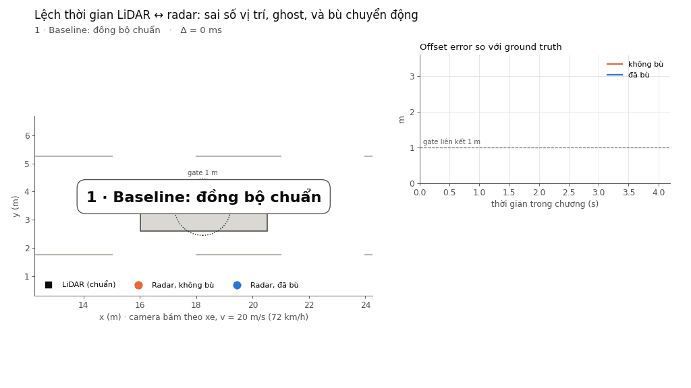

# T4 — Time sync / motion compensation (LiDAR ↔ radar, xe ADAS)

## 1. Problem (Bước 1)

| Nhóm cần chốt | Nội dung |
|---|---|
| Nền tảng, tính năng, sensor | Xe ADAS; tính năng **fusion LiDAR + radar để theo dõi xe phía trước/bên cạnh**; LiDAR 10 Hz, radar 20 Hz |
| Failure case | Timestamp của radar bị lệch Δ (buffer driver, clock không đồng bộ PTP, trễ CAN/Ethernet). Radar đo ở thời điểm `t − Δ` nhưng gắn nhãn `t` |
| Claim ban đầu | Khi Δ tăng, sai số vị trí tăng xấp xỉ **v × Δ**, ghost rate tăng vọt khi v × Δ vượt gate liên kết; bù chuyển động đưa sai số về mức nhiễu sensor |
| Metric và đơn vị | offset error (m), ghost rate (%), trajectory residual (m), sai số ước lượng offset (ms) — định nghĩa ở mục 3 |
| Baseline và điều kiện lỗi | Baseline Δ = 0 ms; lỗi Δ = 25 / 50 / 100 / 150 / 200 ms; v = 5 / 10 / 20 / 30 m/s |
| Phân công 5 thành viên | *(điền tên)* — đọc nguồn: …; chạy code: …; ghi benchmark: …; failure case: …; trình bày: … |

## 2. Method (Bước 2)

### Nguồn chính: Qin & Shen, IROS 2018

**T. Qin, S. Shen, *Online Temporal Calibration for Monocular Visual-Inertial Systems*, IROS 2018** — [arXiv:1808.00692](https://arxiv.org/abs/1808.00692) (bản v1, 2/8/2018). Code nằm trong [VINS-Mono](https://github.com/HKUST-Aerial-Robotics/VINS-Mono), commit `90dabb5` (HEAD ngày 23/05/2024, nhóm chỉ đọc, không chạy).

| Câu hỏi khi đọc nguồn | Ghi chép |
|---|---|
| Phương pháp nhận gì và tạo gì? | **Input:** ảnh camera monocular (feature track) + IMU (gia tốc, gyro) có timestamp lệch nhau. **Output:** time offset `td` ước lượng online, cùng pose, vận tốc, bias IMU và vị trí feature (VIO). Định nghĩa: `t_IMU = t_cam + td` (Mục III-A, phương trình 1) |
| Cách làm | (1) Tính **vận tốc của feature trên mặt phẳng ảnh** từ 2 frame liên tiếp: `V = (z_{k+1} − z_k) / (t_{k+1} − t_k)` (pt. 2), giả định camera chuyển động với vận tốc không đổi trong khoảng ngắn. (2) Dịch quan sát feature theo thời gian: `z(td) = z + td·V` (pt. 4, 6), rồi đưa `td` vào vector trạng thái và tối ưu chung trong bundle adjustment cửa sổ trượt (pt. 7–8, giải bằng Ceres). (3) Sau mỗi lần tối ưu, cộng `td` vào timestamp camera và lặp lại để `δtd → 0`, theo kiểu từ thô tới mịn (Mục III-E) |
| Nguồn đo chất lượng bằng gì? | **Mô phỏng:** 500 feature, nhiễu ảnh 0,5 px, IMU 100 Hz, camera 10 Hz, 30 s; offset 5/15/30 ms, 100 lần thử mỗi mức; metric là **sai số trung bình, RMSE (ms), NEES** (Bảng I). **Cảm biến thật:** Intel RealSense ZR300, so với **Kalibr** (offline, cần bảng chessboard) theo 5 mức exposure 20–30 ms (Hình 6). **VIO:** EuRoC MAV (MH_01/03/05, V1_01/03, V2_02), offset được cộng nhân tạo vào timestamp IMU; metric là **RMSE quỹ đạo (m)** và **relative pose error**, so với VINS-Mono gốc và OKVIS (Bảng II, Hình 7–8). Thí nghiệm thật đi bộ cầm tay, ground truth từ OptiTrack (Hình 10–13) |
| Chạy được ở lớp không? | **Không** trong 120 phút: README VINS-Mono yêu cầu Ubuntu 16.04 + ROS Kinetic + Ceres, dataset EuRoC dạng rosbag; lệnh `roslaunch vins_estimator euroc.launch`. Bật hiệu chuẩn thời gian bằng `estimate_td: 1`, giá trị khởi tạo `td` (đơn vị s) trong `config/euroc/euroc_config.yaml`. Config còn có `rolling_shutter` và `rolling_shutter_tr` cho phần mở rộng |
| Nhóm tái hiện phần nào? | **Ý tưởng cốt lõi**, không phải hệ VIO: (a) bù chuyển động tuyến tính `z + v·td` (tương ứng pt. 4) → `comp_known`, `comp_est`; (b) coi offset là ẩn số và tìm giá trị làm hai sensor nhất quán → grid search trong `comp_est`. Khác biệt: nhóm dùng **LiDAR–radar 2D mô phỏng**, vận tốc vật thể lấy từ track LiDAR (paper dùng vận tốc feature trên ảnh), ước lượng offset bằng grid search offline (paper tối ưu phi tuyến online) |
| Giả định / limitation **do paper nêu** | `td` là **hằng số nhưng chưa biết**; nếu offset **trôi theo thời gian** thì paper xếp sensor đó là "không đủ điều kiện cho fusion" (Mục III-A). Vận tốc feature không đổi chỉ đúng trong thời gian ngắn, nên offset lớn phải bù dần từ thô tới mịn (III-E). Thí nghiệm thật phải đảm bảo **đủ chuyển động quay và gia tốc** để calibration quan sát được (IV-B.2) |

**Quy ước dấu (dễ nhầm khi bị hỏi):** paper lấy IMU làm đồng hồ chuẩn; `td` là lượng cần cộng vào timestamp camera để khớp IMU. Camera trễ hơn IMU thì `td < 0` (Mục III-A). Benchmark của nhóm lấy LiDAR làm chuẩn (vai IMU), radar có vai camera, và Δ = độ trễ của radar, nên **Δ_nhóm = −td_paper**.

### Nguồn phụ (chưa đọc kỹ, chỉ dùng làm tham chiếu)

- Furgale, Rehder, Siegwart, *Unified Temporal and Spatial Calibration for Multi-Sensor Systems*, IROS 2013 ([DOI](https://doi.org/10.1109/iros.2013.6696514)) — repo [Kalibr](https://github.com/ethz-asl/kalibr). Ước lượng offset offline với bảng hiệu chuẩn; Qin & Shen dùng Kalibr làm mốc so sánh.
- Huai et al., *Continuous-Time Spatiotemporal Calibration of a Rolling Shutter Camera-IMU System* ([arXiv:2108.07200](https://arxiv.org/abs/2108.07200), nguồn S9 trong đề) — dùng cho phần mở rộng rolling shutter.

**Thuật toán trong benchmark** ([benchmark.py](benchmark.py)):

| | Input | Output | Giả định |
|---|---|---|---|
| `none` | điểm radar + timestamp | dùng nguyên | timestamp đúng |
| `comp_known` | điểm radar, Δ từ datasheet, vận tốc ước lượng từ track LiDAR | `z + v·Δ` | biết Δ, vận tốc gần không đổi trong khoảng Δ |
| `comp_est` | chuỗi radar + chuỗi LiDAR | Δ̂ = argmin RMS residual (grid search ±300 ms, bước 1 ms), rồi bù `z + v·Δ̂` | Δ không đổi, đối tượng **phải chuyển động** để Δ quan sát được |

## 3. Benchmark (Bước 3–4)

- **Dữ liệu:** tổng hợp 2D (không dùng dataset thật). Quỹ đạo: đi thẳng; phanh + rẽ (gia tốc ngang 4 m/s²); jitter (Δ = 100 ± 30 ms); đứng yên. Mỗi lần chạy 20 s, 5 seed `[0..4]`.
- **Sensor:** LiDAR 10 Hz, σ = 0,05 m, timestamp đúng (làm mốc). Radar 20 Hz, σ = 0,15 m, lệch Δ.
- **Metric** (cùng một cách tính cho mọi điều kiện):
  - **Offset error (m)** — `|radar sau xử lý − ground truth tại timestamp|`, trung bình và p95. Thấp hơn là tốt. Cần ground truth → chỉ đo được trong mô phỏng.
  - **Ghost rate (%)** — tỉ lệ điểm radar cách vị trí LiDAR (nội suy cùng timestamp) quá **gate 1,0 m** → fusion không ghép được, sinh object thứ hai hoặc bỏ điểm. Thấp hơn là tốt. Đây là **proxy**, chưa phải số ghost của một tracker thật.
  - **Trajectory residual (m)** — RMS khoảng cách radar ↔ LiDAR. Không cần ground truth, có thể **giám sát online** trên xe.
  - **Offset estimation error (ms)** — `|Δ̂ − Δ|`, chỉ với `comp_est`.

**Chạy lại:**

```bash
python benchmark.py
```

Yêu cầu Python 3.11, numpy 1.26, pandas 2.2, matplotlib 3.10. Kết quả: `results/summary.md` (bảng), `results/results_raw.csv`, `results/results_agg.csv`, `results/run_log.txt`, `results/fig*.png`.

### Kết quả chính (v = 20 m/s ≈ 72 km/h, đi thẳng, trung bình 5 seed)

| Δ (ms) | Offset error, không bù (m) | Ghost rate, không bù (%) | Residual, không bù (m) | Offset error, có bù (m) | Ghost rate, có bù (%) |
|---|---|---|---|---|---|
| 0 (baseline) | 0,19 | 0,0 | 0,22 | 0,19 | 0,0 |
| 25 | 0,53 | 0,3 | 0,55 | 0,19 | 0,0 |
| 50 | 1,02 | 54,6 | 1,03 | 0,19 | 0,0 |
| 100 | 2,01 | 100 | 2,02 | 0,19 | 0,0 |
| 200 | 4,01 | 100 | 4,01 | 0,20 | 0,0 |

- Công thức **sai số ≈ v × Δ** đúng với tỉ lệ đo/dự đoán ≈ 1,0 khi v × Δ lớn hơn nhiều so với nhiễu (bảng 2 trong `summary.md`, `fig3`). Khi v × Δ nhỏ (ví dụ 5 m/s × 25 ms = 0,12 m), nhiễu radar 0,15 m chiếm phần lớn sai số.
- **Offset tới hạn** = gate / v: 200 ms ở 18 km/h, 50 ms ở 72 km/h, **33 ms ở 108 km/h**.


### Video demo

`python demo_video.py` → [results/demo_time_sync.gif](results/demo_time_sync.gif) (khoảng 22 s, 4 chương: Δ = 0 / 50 / 100 ms và jitter 100 ± 30 ms; ảnh tĩnh `results/demo_frame_ch*.png`). Xe nhìn từ trên xuống, camera bám theo xe; hình vuông đen là LiDAR, chấm cam là radar không bù, chấm xanh là radar đã bù, vòng chấm là gate 1 m. Khi radar rơi ra ngoài gate, video vẽ khung xe nét đứt với nhãn **GHOST**.



## 4. Failure case (Bước 5)

**Nhóm quan sát được** (Δ = 100 ms, v = 20 m/s, bảng 4 trong `summary.md`, `fig4`, `fig6`):

1. **Jitter timestamp (Δ = 100 ± 30 ms):** bù với một Δ cố định chỉ sửa được phần lệch trung bình. Offset error vẫn còn 0,54 m (p95 1,21 m), ghost rate **11,7 %** so với 0 % khi Δ ổn định. Phần còn lại ≈ v × σ_jitter = 20 × 0,03 = 0,6 m.
2. **Đứng yên — metric không phát hiện được lỗi:** khi xe đứng yên, residual = 0,22 m và ghost rate = 0 % dù Δ = 100 ms, vì Δ không ảnh hưởng gì nếu không có chuyển động. Bộ ước lượng `comp_est` cho Δ̂ sai trung bình **123 ms** (hàm chi phí phẳng, `fig6`). Nếu dùng Δ̂ này khi xe chạy tiếp, sai số sẽ quay lại.
3. Phanh + rẽ (gia tốc ngang 4 m/s²): bù vận tốc không đổi **vẫn đủ** ở Δ = 100 ms (0,19 m). Đây là kết quả ngược với dự đoán ban đầu: sai số bậc hai ≈ ½·a·Δ² = 0,02 m, nhỏ hơn nhiều so với nhiễu.

**Paper cho biết** (Qin & Shen 2018, camera–IMU, **không cùng dataset/metric với nhóm, không so sánh trực tiếp các con số**):

- Offset thực tế "từ vài ms tới hàng trăm ms", nguyên nhân là trễ kích hoạt, trễ truyền và clock không đồng bộ (Mục I, III-A). Hình 6 cho thấy offset của camera thật thay đổi theo exposure (độ dốc ≈ 0,5), tức là offset không chỉ do trễ truyền cố định.
- Không hiệu chuẩn thời gian thì VINS-Mono gốc chỉ chịu được offset trong khoảng **khoảng 6 ms** trên chuỗi EuRoC MH_03; RMSE tăng theo dạng parabol khi offset tăng (Hình 7). OKVIS (không có bù thời gian) có RMSE tăng mạnh khi offset lên 30 ms, ví dụ MH_03: **2,805 m**, so với **0,195 m** của phương pháp đề xuất (Bảng II).
- Với hiệu chuẩn online, offset ước lượng sát giá trị đặt (ví dụ 30 ms → 30,17 ms, RMSE 0,68 ms trong mô phỏng, Bảng I) và hội tụ "trong vài giây" (Hình 9).

**Đối chiếu với kết quả nhóm:** cả hai cùng thấy sai số tăng khi offset tăng và bù tuyến tính theo vận tốc là đủ khi offset ổn định. Hai failure case của nhóm khớp với giả định paper tự nêu: **jitter** vi phạm giả định `td` hằng số (paper loại trường hợp offset trôi ra khỏi phạm vi), và **đứng yên** vi phạm điều kiện "đủ chuyển động" để offset quan sát được.

**Giới hạn:** dữ liệu tổng hợp 2D; nhiễu Gauss; ghost rate là proxy dựa trên gate, chưa chạy tracker thật; chưa có rolling shutter, chưa có ego-motion; LiDAR được coi là có timestamp đúng tuyệt đối. *Giả thuyết (chưa đo):* trên xe thật, jitter còn tương quan với tải CPU/mạng.

## 5. Engineering decision

1. **Luôn bù chuyển động theo timestamp** ở tầng fusion; với v ≤ 30 m/s và gate 1 m, độ lệch còn lại sau sync phải **< 33 ms**, mục tiêu **< 10 ms** (sai số 0,3 m ở 108 km/h).
2. **Giám sát trajectory residual online** (không cần ground truth): nếu RMS residual > 0,5 m kéo dài khi v > 5 m/s, báo lỗi time sync và giảm trọng số radar.
3. **Chỉ ước lượng/cập nhật Δ̂ khi có đủ chuyển động** (ví dụ v > 3 m/s); khi đứng yên, giữ Δ̂ cũ, không cập nhật.
4. **Jitter không bù được bằng một hằng số** → cần timestamp phần cứng hoặc PTP (IEEE 1588) ở driver, và log độ lệch tâm từng frame. Kiểm chứng lần sau: chạy lại kịch bản jitter với σ = 5/10/30 ms, mục tiêu ghost rate < 1 %.
